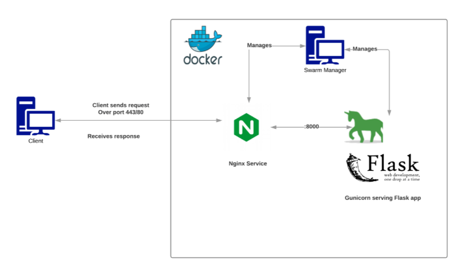

# Overview 



# Componient

## 1. Flask 

- **Flask server** thường thì k xử lí được nhiều request(tầm 1k req)
- **WSGI servers** : trong đó có **Gunicorn** 

## 2. Nginx service

- in product -> **proxy servers** : ```Nginx``` or ```Apache```
- python thường dùng Nginx 
- **upstream server** : ```Gunicorn``` : to little faster
- **certificates** : để bảo mật cho máy chủ, tool ví dụ ```Certbot```
